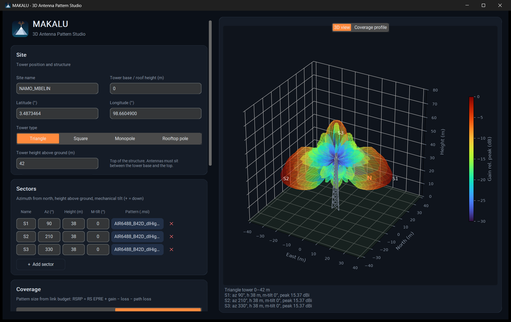

<h1 align="center">MAKALU · 3D Antenna Pattern Studio</h1>

Part of the 14 Peaks series · Makalu, 8,485 m

MAKALU reads MSI Planet antenna pattern files (`.msi` / `.pln`), rebuilds the
3D radiation pattern from the horizontal and vertical cuts, sizes it with a
link budget and exports a KMZ with a 3D tower, antenna panels, the 3D beam and
RSRP ground footprints for Google Earth.

## Features

- 3D pattern reconstruction from MSI horizontal and vertical cuts
- Electrical tilt from the file, mechanical tilt per sector
- Beam size from link budget: Tx power → RS EPRE + gain − loss − path loss
  (3GPP TR 38.901 UMa / UMi, free space)
- RSRP coverage profile along boresight and −85 / −95 / −105 dBm ground footprints
- 3D towers (triangle, square, monopole, rooftop pole) scaled to real size
- KMZ export for Google Earth Web and Google Earth Pro

## Download

Get `Makalu-v1.0.0-win64.zip` from [Releases](https://github.com/daiyabarus/makalu/releases/latest),
unzip and run `Makalu.exe` (Windows 10/11, no install). Sample MSI files are
in the `samples` folder.

- The exe is not code-signed yet. If Windows SmartScreen shows
  "Windows protected your PC", click **More info → Run anyway**.
- Each build works for 30 days. When it locks, contact
  [@daiyabarus](https://github.com/daiyabarus) for a new build.

## Limitations

Coverage is a model estimate without terrain or building data. Use it to
explore antenna patterns, not as a replacement for a planning tool.
